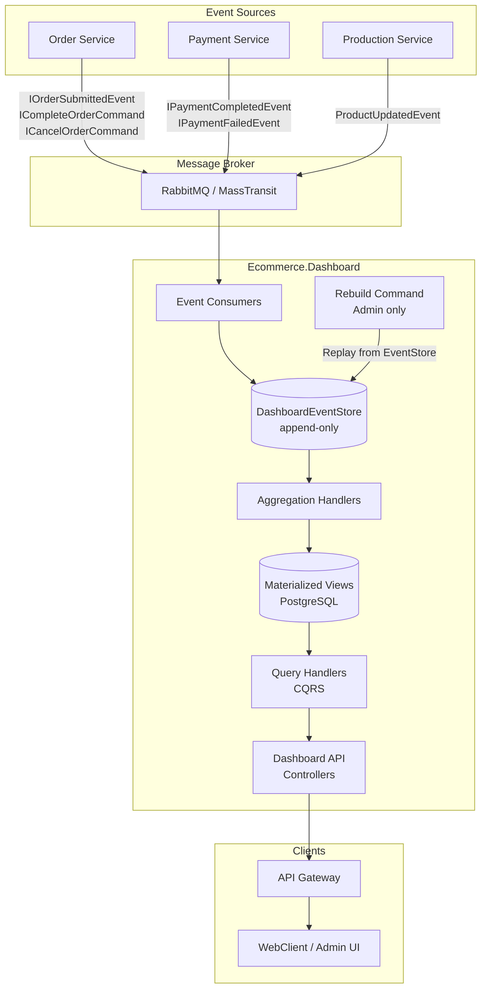
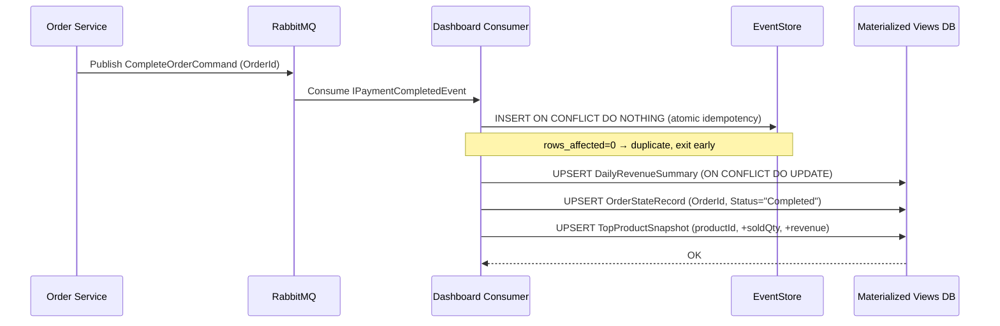
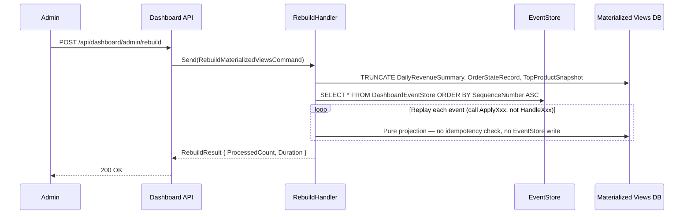
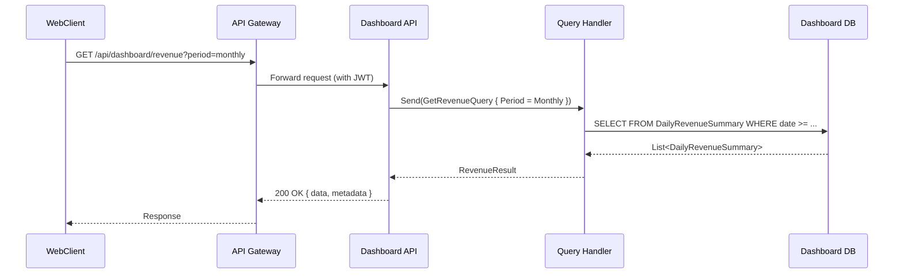

# Design Document: Ecommerce Dashboard API

## Overview

Dashboard API is a standalone service (`Ecommerce.Dashboard`) in the microservice system, responsible for providing aggregated metrics for the ecommerce admin interface. The service operates on a **CQRS + Materialized View + EventStore** model: it listens to integration events from Order, Payment, and Production services via RabbitMQ/MassTransit to pre-aggregate data into dedicated read models, ensuring all dashboard APIs return pre-computed results — never querying real-time against other services.

The system continues using **RabbitMQ** (already in place) instead of Kafka, but adds a `DashboardEventStore` table (append-only) to store all received raw events. This enables **full rebuild of materialized views** at any time without Kafka — solving the problem of data loss when the service is down or aggregation logic needs to change.

The service is located at `Services/Ecommerce.Dashboard/`, following the same Clean Architecture (Domain / Application / Infrastructure / API) as existing services in the system.

## Architecture



## Sequence Diagrams

### Materialized View Update Flow when Order Completes



### Rebuild Materialized Views from EventStore Flow



### Dashboard API Query Flow



## Components and Interfaces

### Component 1: Event Consumers (Infrastructure Layer)

**Purpose**: Receive integration events from RabbitMQ and dispatch to Aggregation Handlers.

**Interface**:
```csharp
// Consumers registered via MassTransit Assembly scanning
public class PaymentCompletedConsumer : IConsumer<IPaymentCompletedEvent>
{
    Task Consume(ConsumeContext<IPaymentCompletedEvent> context);
}

public class OrderSubmittedConsumer : IConsumer<IOrderSubmittedEvent>
{
    Task Consume(ConsumeContext<IOrderSubmittedEvent> context);
}

public class OrderCancelledConsumer : IConsumer<ICancelOrderCommand>
{
    Task Consume(ConsumeContext<ICancelOrderCommand> context);
}
```

**Responsibilities**:
- Deserialize event payload
- **Store raw event in `DashboardEventStore` (first step, before any aggregation)**
- Dispatch MediatR command for aggregation processing
- Idempotency: handled atomically via `INSERT ON CONFLICT DO NOTHING`

---

### Component 2: Aggregation Command Handlers (Application Layer)

**Purpose**: Update materialized views in Dashboard DB based on event data. Split into two function types:
- `HandleXxx`: used when receiving events from RabbitMQ — has idempotency, writes to EventStore, has side effects
- `ApplyXxx`: used during rebuild — pure projection, no side effects

**Interface**:
```csharp
public record UpdateRevenueOnPaymentCommand(
    Guid OrderId,
    decimal Amount,
    DateTime OccurredOn
) : ICommand;

public record UpdateOrderStateCommand(
    Guid OrderId,
    string NewStatus,
    DateTime OccurredOn
) : ICommand;

public record UpdateTopProductsCommand(
    List<OrderItemDto> Items,
    DateTime OccurredOn
) : ICommand;
```

**Responsibilities**:
- Upsert `DailyRevenueSummary` per day (using `INSERT ON CONFLICT DO UPDATE`)
- Upsert `OrderStateRecord` per OrderId (set-based, not counter-based)
- Upsert `TopProductSnapshot` (total quantity sold, total revenue per product)

---

### Component 2b: Rebuild Handler (Application Layer)

**Purpose**: Replay all events from `DashboardEventStore` to rebuild materialized views — used when there is a bug in aggregation logic or schema changes.

**Interface**:
```csharp
public record RebuildMaterializedViewsCommand() : ICommand<RebuildResult>;

public record RebuildResult(int ProcessedCount, TimeSpan Duration);
```

**Responsibilities**:
- Truncate all materialized view tables (do NOT delete EventStore)
- Read `DashboardEventStore` ordered by `SequenceNumber ASC` (not `OccurredOn`)
- Call `ApplyXxx` (pure projection) — do not call `HandleXxx`
- Does not affect `DashboardEventStore` (append-only, never deleted)

---

### Component 3: Query Handlers (Application Layer)

**Purpose**: Read data from Dashboard DB and return DTOs to the API layer.

**Interface**:
```csharp
public record GetRevenueSummaryQuery(DateRangeFilter Filter) : IQuery<RevenueSummaryResult>;
public record GetOrderStatusSummaryQuery() : IQuery<OrderStatusSummaryResult>;
public record GetTopProductsQuery(int TopN, DateRangeFilter? Filter) : IQuery<TopProductsResult>;
public record GetRevenueTimeSeriesQuery(TimePeriod Period, DateRangeFilter Filter) : IQuery<RevenueTimeSeriesResult>;
```

**Responsibilities**:
- Read from read models only (no joins to other services)
- Apply date/week/month filters
- Return data formatted for UI consumption

---

### Component 4: Dashboard API Controllers (API Layer)

**Purpose**: Expose REST endpoints via API Gateway.

**Interface**:
```csharp
[ApiController]
[Route("api/dashboard")]
[Authorize]
public class DashboardController : ControllerBase
{
    Task<IActionResult> GetRevenueSummary([FromQuery] DateRangeFilter filter);
    Task<IActionResult> GetOrderStatusSummary();
    Task<IActionResult> GetTopProducts([FromQuery] int topN = 10, [FromQuery] DateRangeFilter? filter = null);
    Task<IActionResult> GetRevenueTimeSeries([FromQuery] TimePeriod period, [FromQuery] DateRangeFilter filter);
}
```

---

## Data Models

### Read Model 1: DailyRevenueSummary

```csharp
public class DailyRevenueSummary : Entity<Guid>
{
    public DateTime Date { get; set; }           // Truncated to day (UTC)
    public decimal TotalRevenue { get; set; }    // Total revenue for the day
    public int CompletedOrderCount { get; set; } // Number of completed orders
    public int CancelledOrderCount { get; set; } // Number of cancelled orders
}
```

**Validation Rules**:
- `Date` is a unique index (one record per day)
- `TotalRevenue >= 0`
- Only updated from `IPaymentCompletedEvent` (not from pending/cancelled orders)

---

### Read Model 2: OrderStateRecord (Set-based, replaces counter snapshot)

> **Reason for change**: Counter-based snapshot (`+1/-1`) accumulates permanent drift if any event is missed or processed incorrectly. Set-based approach stores each order's state individually — always self-heals on rebuild, never drifts.

```csharp
public class OrderStateRecord : Entity<Guid>
{
    // Id = OrderId
    public string Status { get; set; } = string.Empty;  // "Draft" | "Pending" | "Completed" | "Cancelled"
    public DateTime LastUpdatedAt { get; set; }
}
```

**Validation Rules**:
- `Id` (OrderId) is the primary key — each order has exactly 1 row, UPSERT on status change
- `Status` ∈ { "Draft", "Pending", "Completed", "Cancelled" }
- Dashboard query: `SELECT Status, COUNT(*) FROM OrderStateRecord GROUP BY Status`

**Advantages over counter**:
- Rebuild from EventStore always produces correct results (idempotent by nature)
- No negative counters or drift ever
- Easy to debug: can inspect the state of each individual order

---

### Read Model 3: TopProductSnapshot

```csharp
public class TopProductSnapshot : Entity<Guid>
{
    public Guid ProductId { get; set; }
    public string ProductName { get; set; } = string.Empty;
    public int TotalQuantitySold { get; set; }
    public decimal TotalRevenue { get; set; }
    public DateTime LastSoldAt { get; set; }
}
```

**Validation Rules**:
- `ProductId` is a unique index
- `TotalQuantitySold >= 0`, `TotalRevenue >= 0`
- Updated only from `IPaymentCompletedEvent` (only successfully paid orders)

---

### Read Model 4: DashboardEventStore (Event Replay)

```csharp
public class DashboardEventStore : Entity<Guid>
{
    // Id = EventId from IntegrationEvent
    public string EventType { get; set; } = string.Empty;   // e.g. "PaymentCompleted"
    public string Payload { get; set; } = string.Empty;     // JSON serialized raw event
    public DateTime OccurredOn { get; set; }                // When the event occurred (UTC) — metadata only
    public DateTime ReceivedAt { get; set; }                // When the consumer received it
    public long SequenceNumber { get; set; }                // Auto-increment, used for ordering during replay
}
```

**Validation Rules**:
- `Id` (EventId) is the primary key
- Append-only — never UPDATE or DELETE
- `Payload` stores the full event JSON for deserialization at any time
- `SequenceNumber` is `BIGSERIAL` (PostgreSQL auto-increment) — **this is the only reliable ordering column**
- `OccurredOn` is metadata only, NOT used for sorting during replay (clock skew from source services)

**Purpose**:
- When Dashboard service is down and misses events, replay from EventStore instead of losing data
- When aggregation logic has a bug, truncate materialized views and rebuild from EventStore
- Full audit trail of all business events affecting the dashboard

---

### DTOs (Response)

```csharp
public record RevenueSummaryResult(
    decimal TotalRevenue,
    int TotalCompletedOrders,
    decimal AverageOrderValue,
    DateTime FromDate,
    DateTime ToDate
);

public record OrderStatusSummaryResult(
    int Draft,
    int Pending,
    int Completed,
    int Cancelled,
    int Total
);

public record TopProductsResult(List<TopProductItem> Items);

public record TopProductItem(
    Guid ProductId,
    string ProductName,
    int TotalQuantitySold,
    decimal TotalRevenue
);

public record RevenueTimeSeriesResult(
    TimePeriod Period,
    List<RevenueDataPoint> DataPoints
);

public record RevenueDataPoint(
    DateTime Date,
    decimal Revenue,
    int OrderCount
);
```

---

## Algorithmic Pseudocode

### Algorithm 1: Handle PaymentCompletedEvent (Atomic Idempotency)

```pascal
PROCEDURE HandlePaymentCompleted(event: IPaymentCompletedEvent)
  INPUT: event (OrderId, TransactionId, OccurredOn, Amount, Items)
  OUTPUT: void (side effects: update materialized views)

  BEGIN
    // Start DB transaction — idempotency check MUST be inside the transaction
    BEGIN TRANSACTION

      // 0. Insert into EventStore — INSERT ON CONFLICT DO NOTHING
      //    Atomic: if EventId already exists, rows_affected = 0, skip everything
      rows_affected ← DashboardEventStore.InsertIfNotExists({
        Id = event.Id,
        EventType = "PaymentCompleted",
        Payload = JSON.Serialize(event),
        OccurredOn = event.OccurredOn,
        ReceivedAt = NOW()
        // SequenceNumber auto-assigned by DB (BIGSERIAL)
      })
      // SQL: INSERT INTO DashboardEventStore (...) VALUES (...)
      //      ON CONFLICT (Id) DO NOTHING

      IF rows_affected = 0 THEN
        ROLLBACK
        LOG "Duplicate event {event.Id}, skipping"
        RETURN  // Idempotent exit — do not reprocess
      END IF

      // 1. Update DailyRevenueSummary
      date ← TruncateToDay(event.OccurredOn)
      // SQL: INSERT INTO DailyRevenueSummary (Date, TotalRevenue, CompletedOrderCount)
      //      VALUES (date, amount, 1)
      //      ON CONFLICT (Date) DO UPDATE SET
      //        TotalRevenue = TotalRevenue + EXCLUDED.TotalRevenue,
      //        CompletedOrderCount = CompletedOrderCount + 1
      DailyRevenueSummary.UpsertAtomic(date, event.Amount)

      // 2. Update OrderStateRecord (set-based, not counter)
      // SQL: INSERT INTO OrderStateRecord (Id, Status, LastUpdatedAt)
      //      VALUES (orderId, 'Completed', now)
      //      ON CONFLICT (Id) DO UPDATE SET Status = 'Completed', LastUpdatedAt = now
      OrderStateRecord.Upsert(event.OrderId, "Completed", NOW())

      // 3. Update TopProductSnapshot for each item
      FOR each item IN event.Items DO
        // SQL: INSERT INTO TopProductSnapshot (ProductId, TotalQuantitySold, TotalRevenue, LastSoldAt)
        //      VALUES (productId, qty, revenue, now)
        //      ON CONFLICT (ProductId) DO UPDATE SET
        //        TotalQuantitySold = TotalQuantitySold + EXCLUDED.TotalQuantitySold,
        //        TotalRevenue = TotalRevenue + EXCLUDED.TotalRevenue,
        //        LastSoldAt = EXCLUDED.LastSoldAt
        TopProductSnapshot.UpsertAtomic(item.ProductId, item.Quantity, item.UnitPrice * item.Quantity, NOW())
      END FOR

    COMMIT TRANSACTION

  EXCEPTION
    ROLLBACK TRANSACTION
    LOG error
    RETHROW (MassTransit will retry)
  END
END PROCEDURE
```

**Why atomic idempotency works**:
- `INSERT ... ON CONFLICT DO NOTHING` is a single SQL statement — atomic at the DB level
- No time window between "check" and "insert" → no race condition
- If 2 consumer instances process the same event concurrently, only 1 insert succeeds (rows_affected = 1), the other gets rows_affected = 0 and exits immediately
- Everything is in 1 transaction: EventStore insert + materialized view updates are atomic

**Preconditions**:
- `event.Amount > 0`
- `event.Items` is not empty
- Dashboard DB is available

**Postconditions**:
- `DashboardEventStore` contains the raw event (append-only)
- `DailyRevenueSummary` for the corresponding day is updated
- `OrderStateRecord` for `event.OrderId` has Status = "Completed"
- Each product in `event.Items` is updated in `TopProductSnapshot`

**Loop Invariants**:
- Each item is processed exactly once within a single transaction
- Total revenue in `TopProductSnapshot` always equals the sum of `UnitPrice * Quantity` across all completed orders

---

### Algorithm 2: Query GetRevenueTimeSeries

```pascal
PROCEDURE GetRevenueTimeSeries(period: TimePeriod, filter: DateRangeFilter)
  INPUT: period (Daily | Weekly | Monthly), filter (FromDate, ToDate)
  OUTPUT: RevenueTimeSeriesResult

  BEGIN
    ASSERT filter.FromDate <= filter.ToDate
    ASSERT filter.ToDate - filter.FromDate <= MAX_RANGE[period]

    rows ← DailyRevenueSummary.QueryByDateRange(filter.FromDate, filter.ToDate)

    IF period = Daily THEN
      dataPoints ← rows.Select(r => RevenueDataPoint(r.Date, r.TotalRevenue, r.CompletedOrderCount))

    ELSE IF period = Weekly THEN
      grouped ← rows.GroupBy(r => GetWeekStart(r.Date))
      dataPoints ← grouped.Select(g => RevenueDataPoint(
        g.Key,
        g.Sum(r => r.TotalRevenue),
        g.Sum(r => r.CompletedOrderCount)
      ))

    ELSE IF period = Monthly THEN
      grouped ← rows.GroupBy(r => GetMonthStart(r.Date))
      dataPoints ← grouped.Select(g => RevenueDataPoint(
        g.Key,
        g.Sum(r => r.TotalRevenue),
        g.Sum(r => r.CompletedOrderCount)
      ))
    END IF

    RETURN RevenueTimeSeriesResult(period, dataPoints.OrderBy(d => d.Date))
  END
END PROCEDURE
```

**Preconditions**:
- `filter.FromDate <= filter.ToDate`
- `period` is one of: Daily, Weekly, Monthly

**Postconditions**:
- Result is sorted ascending by `Date`
- No data point falls outside the `filter` range
- Aggregation by period is correct (weekly/monthly is the sum of daily rows)

---

### Algorithm 3: Rebuild Materialized Views from EventStore (Pure Projection)

```pascal
PROCEDURE RebuildMaterializedViews()
  INPUT: none
  OUTPUT: RebuildResult (processedCount, duration)

  BEGIN
    startTime ← NOW()

    // 1. Clear all materialized views (do NOT delete EventStore)
    //    DashboardEventStore is the source of truth — never truncated
    BEGIN TRANSACTION
      TRUNCATE DailyRevenueSummary
      TRUNCATE OrderStateRecord
      TRUNCATE TopProductSnapshot
      // DO NOT truncate DashboardEventStore
    COMMIT

    // 2. Replay each event ordered by SequenceNumber ASC (NOT OccurredOn)
    //    SequenceNumber is BIGSERIAL assigned by DB — guarantees absolute ordering,
    //    unaffected by clock skew from source services
    events ← DashboardEventStore.QueryAll(ORDER BY SequenceNumber ASC)
    count ← 0

    FOR each storedEvent IN events DO
      payload ← JSON.Deserialize(storedEvent.Payload, storedEvent.EventType)

      // Call ApplyProjection — NOT HandleXxx (no side effects)
      CASE storedEvent.EventType OF
        "PaymentCompleted" → ApplyPaymentCompleted(payload)
        "OrderSubmitted"   → ApplyOrderSubmitted(payload)
        "OrderCancelled"   → ApplyOrderCancelled(payload)
      END CASE

      count ← count + 1
    END FOR

    RETURN RebuildResult(count, NOW() - startTime)
  END
END PROCEDURE

// Pure projection — no idempotency check, no EventStore write, no side effects
PROCEDURE ApplyPaymentCompleted(payload: PaymentCompletedPayload)
  BEGIN
    date ← TruncateToDay(payload.OccurredOn)
    DailyRevenueSummary.UpsertAtomic(date, payload.Amount)
    OrderStateRecord.Upsert(payload.OrderId, "Completed", payload.OccurredOn)
    FOR each item IN payload.Items DO
      TopProductSnapshot.UpsertAtomic(item.ProductId, item.Quantity, item.UnitPrice * item.Quantity, payload.OccurredOn)
    END FOR
  END
END PROCEDURE
```

**Why `ApplyXxx` is separate from `HandleXxx`**:
- `HandleXxx` has side effects: writes to EventStore, idempotency check, retry logic
- `ApplyXxx` is a pure projection: reads payload → writes to materialized view only
- Rebuild calls `ApplyXxx` directly → not blocked by idempotency check, does not re-write EventStore
- Ordering uses `SequenceNumber` (DB-assigned) instead of `OccurredOn` (source clock) → correct consumer-received order

**Preconditions**:
- Only Admin can call this endpoint
- `DashboardEventStore` is not deleted during rebuild

**Postconditions**:
- Materialized views accurately reflect all events in EventStore in SequenceNumber order
- `DashboardEventStore` is unchanged (append-only invariant)

---

## Key Functions with Formal Specifications

### Function: Idempotency (Atomic via INSERT ON CONFLICT)

```csharp
// No longer a separate function — idempotency is handled directly in the transaction
// via INSERT ... ON CONFLICT DO NOTHING and checking rows affected.
// See Algorithm 1 for implementation details.
//
// Pattern:
//   var rowsAffected = await dbContext.Database.ExecuteSqlRawAsync(
//       "INSERT INTO dashboard_event_store (...) VALUES (...) ON CONFLICT (id) DO NOTHING");
//   if (rowsAffected == 0) return; // duplicate, skip
```

**Why not use SELECT + INSERT separately**:
- SELECT → INSERT has a TOCTOU race condition: 2 threads both SELECT "not found" → both INSERT → duplicate processing
- `INSERT ON CONFLICT DO NOTHING` is atomic at the PostgreSQL level — only 1 of 2 concurrent inserts succeeds

---

### Function: AggregateByPeriod

```csharp
List<RevenueDataPoint> AggregateByPeriod(
    IEnumerable<DailyRevenueSummary> dailyRows,
    TimePeriod period)
```

**Preconditions**:
- `dailyRows` is sorted ascending by `Date`
- `period` ∈ { Daily, Weekly, Monthly }

**Postconditions**:
- Result has ≤ number of input elements
- `∀ point ∈ result: point.Revenue = Σ(dailyRows in same period bucket).TotalRevenue`
- `∀ point ∈ result: point.OrderCount = Σ(dailyRows in same period bucket).CompletedOrderCount`

---

## Example Usage

```csharp
// 1. Consumer receives event and dispatches command
public class PaymentCompletedConsumer : IConsumer<IPaymentCompletedEvent>
{
    private readonly IMediator _mediator;

    public async Task Consume(ConsumeContext<IPaymentCompletedEvent> context)
    {
        var evt = context.Message;
        await _mediator.Send(new UpdateRevenueOnPaymentCommand(
            OrderId: evt.OrderId,
            Amount: evt.Amount,          // requires Amount added to IPaymentCompletedEvent
            OccurredOn: DateTime.UtcNow,
            Items: evt.Items             // requires Items added to IPaymentCompletedEvent
        ));
    }
}

// 2. Query from Controller
[HttpGet("revenue/timeseries")]
public async Task<IActionResult> GetRevenueTimeSeries(
    [FromQuery] TimePeriod period = TimePeriod.Monthly,
    [FromQuery] DateTime? from = null,
    [FromQuery] DateTime? to = null)
{
    var filter = new DateRangeFilter(
        from ?? DateTime.UtcNow.AddMonths(-6),
        to ?? DateTime.UtcNow
    );
    var result = await _mediator.Send(new GetRevenueTimeSeriesQuery(period, filter));
    return Ok(ApiResponse.Success(result));
}

// 3. Query top products
[HttpGet("products/top")]
public async Task<IActionResult> GetTopProducts([FromQuery] int topN = 10)
{
    var result = await _mediator.Send(new GetTopProductsQuery(topN, null));
    return Ok(ApiResponse.Success(result));
}

// 4. Rebuild endpoint (Admin only)
[HttpPost("admin/rebuild")]
[Authorize(Roles = "Admin")]
public async Task<IActionResult> RebuildMaterializedViews()
{
    var result = await _mediator.Send(new RebuildMaterializedViewsCommand());
    return Ok(ApiResponse.Success(result));
}
```

---

## Correctness Properties

*A property is a characteristic or behavior that must hold in every valid execution of the system — essentially a formal statement about what the system must do. Properties bridge the gap between natural language specifications and machine-verifiable correctness guarantees.*

### Property 1: Event Processing Idempotency

*For all* events with the same `EventId`, regardless of how many times `Event_Consumer` receives that event (due to retries or at-least-once delivery), the materialized views are updated exactly once — the final result is identical to processing the event exactly once.

**Validates: Requirement 2.1, 2.2**

### Property 2: Revenue Consistency

*For all* sets of processed `IPaymentCompletedEvent`, the sum of `DailyRevenueSummary.TotalRevenue` across all history must equal the sum of `Amount` from all those events.

**Validates: Requirement 3.3, 3.4**

### Property 3: Revenue Monotonicity

*For all* sequences of `IPaymentCompletedEvent`, `DailyRevenueSummary.TotalRevenue` only increases — it never decreases after processing additional events.

**Validates: Requirement 3.3, 3.5**

### Property 4: OrderStateRecord Set-Based Accuracy

*For all* sets of order events, `COUNT(*) FROM OrderStateRecord` must equal the number of unique `OrderId` values that have received events — no duplicate rows or counter drift ever occurs.

**Validates: Requirement 4.1, 4.2**

### Property 5: TopProductSnapshot Accuracy

*For all* sets of `IPaymentCompletedEvent`, `TopProductSnapshot.TotalRevenue` for each `ProductId` must equal the sum of `UnitPrice × Quantity` across all completed order items containing that `ProductId`.

**Validates: Requirement 5.2**

### Property 6: Rebuild Equivalence

*For all* sets of events in `EventStore`, after `RebuildMaterializedViews` completes, the result of every dashboard query must be identical to the result of processing each event sequentially from the beginning in `SequenceNumber ASC` order.

**Validates: Requirement 10.2, 10.3, 10.4**

### Property 7: Serialization Round-Trip

*For all* valid event objects, serializing to JSON and then deserializing must produce an object equivalent to the original.

**Validates: Requirement 14.1, 14.2**

### Property 8: Period Aggregation Consistency

*For all* date ranges and sets of `DailyRevenueSummary`, the sum of `Revenue` across all daily data points must equal the sum across all weekly data points, and also equal the sum across all monthly data points — over the same date range.

**Validates: Requirement 9.4, 9.5**

### Property 9: EventStore Append-Only Invariant

*For all* operations in the system (including rebuild), the number of records in `EventStore` only increases or stays the same — it never decreases.

**Validates: Requirement 1.5, 10.2**

---

## Error Handling

### Scenario 1: Event Consumer fails (DB error, timeout)

**Condition**: Exception occurs during event processing
**Response**: MassTransit automatically retries with exponential backoff policy
**Recovery**: After N failed retries, message moves to Dead Letter Queue (DLQ) for manual handling

### Scenario 2: Duplicate Event (at-least-once delivery, concurrent consumers)

**Condition**: RabbitMQ delivers the same message multiple times, or 2 consumer instances process in parallel
**Response**: `INSERT INTO DashboardEventStore ON CONFLICT DO NOTHING` — atomic at PostgreSQL level, only 1 insert succeeds, rows_affected = 0 → exit early within the same transaction
**Recovery**: No recovery needed — handled automatically, no window for race condition

### Scenario 3: IPaymentCompletedEvent missing Amount/Items

**Condition**: Event payload lacks information needed for aggregation
**Response**: Consumer logs warning and skips (does not throw exception to avoid infinite retries)
**Recovery**: Extend `IPaymentCompletedEvent` interface in BuildingBlocks to add `Amount` and `Items`

### Scenario 4: Dashboard service down, missed events during downtime

**Condition**: Service restarts after being down, RabbitMQ has already dropped unacked messages
**Response**: No automatic recovery mechanism from RabbitMQ
**Recovery**: Admin calls `POST /api/dashboard/admin/rebuild` — EventStore has all the data, rebuilds all materialized views from scratch

### Scenario 5: Dashboard DB unavailable

**Condition**: PostgreSQL connection fails
**Response**: Exception propagates to MassTransit → retry
**Recovery**: Circuit breaker pattern (Polly) to prevent cascade failure

---

## Testing Strategy

### Unit Testing Approach

Test Aggregation Command Handlers and Query Handlers with an in-memory database (EF Core InMemory or SQLite).

Key test cases:
- `HandlePaymentCompleted` with a new event → verify all 3 read models are updated correctly
- `HandlePaymentCompleted` with an already-processed event → verify no changes (idempotency)
- `GetRevenueTimeSeries` with period = Weekly → verify grouping is correct
- Concurrent `HandlePaymentCompleted` with same EventId → verify only one update succeeds

### Property-Based Testing Approach

**Property Test Library**: `FsCheck` (for .NET)

Properties to test:
- **Atomic Idempotency**: Processing the same event N times concurrently produces the same result as processing it once — no partial updates
- **Revenue Monotonicity**: After any number of `PaymentCompleted` events, `TotalRevenue` never decreases
- **Aggregation Correctness**: Sum of daily data points always equals sum of weekly/monthly aggregation over the same date range
- **Rebuild Equivalence**: `RebuildMaterializedViews()` after N events produces the same result as processing N events sequentially from the start
- **Set-based Status**: `COUNT(*) FROM OrderStateRecord` = number of unique OrderIds that have received events

### Integration Testing Approach

Use Testcontainers to spin up real PostgreSQL and RabbitMQ:
- Publish event from test → verify materialized view is updated after consumer processes it
- End-to-end: publish event → query API → verify response data matches event payload

---

## Performance Considerations

- **Index Strategy**: `DailyRevenueSummary.Date` (unique), `TopProductSnapshot.ProductId` (unique), `TopProductSnapshot.TotalQuantitySold DESC` (for top-N query), `DashboardEventStore.SequenceNumber` (clustered, for rebuild), `OrderStateRecord.Status` (for GROUP BY query)
- **Query Complexity**: All dashboard queries are O(n) on the number of days in range, no complex JOINs
- **Caching**: Redis cache (TTL 5 minutes) can be added for `GetOrderStatusSummary` and `GetTopProducts` since data does not need to be absolutely real-time
- **Partitioning**: When `DailyRevenueSummary` grows large (>1 year), partition by year

---

## Security Considerations

- All endpoints require JWT authentication (integrated with `Ecommerce.Authentication` service)
- Only the `Admin` role is permitted to access dashboard endpoints
- Dashboard service does not expose write endpoints externally — only receives data via internal message bus
- API Gateway handles rate limiting before requests reach the Dashboard service

---

## Dependencies

| Dependency | Version | Purpose |
|---|---|---|
| `BuildingBlocks` | internal | Entity base, CQRS interfaces, Pagination |
| `BuildingBlocks.Messaging` | internal | IntegrationEvent, MassTransit extension |
| `MassTransit.RabbitMQ` | 8.x | Message consumer |
| `MediatR` | 12.x | CQRS dispatch |
| `Microsoft.EntityFrameworkCore` | 8.x | ORM for Dashboard DB |
| `Npgsql.EntityFrameworkCore.PostgreSQL` | 8.x | PostgreSQL provider |
| `FsCheck.Xunit` | 2.x | Property-based testing |
| `Testcontainers` | 3.x | Integration testing |

### Events to extend in BuildingBlocks

`IPaymentCompletedEvent` currently only has `OrderId`, `TransactionId`, `PaymentUrl`. Needs to be extended:
```csharp
public interface IPaymentCompletedEvent
{
    Guid OrderId { get; }
    string TransactionId { get; }
    string PaymentUrl { get; }
    decimal Amount { get; }                  // NEW
    List<OrderItemDto> Items { get; }        // NEW
}
```

Alternatively, the Dashboard consumer can subscribe to `IOrderSubmittedEvent` to get Items, then correlate with `IPaymentCompletedEvent` using `OrderId`.
