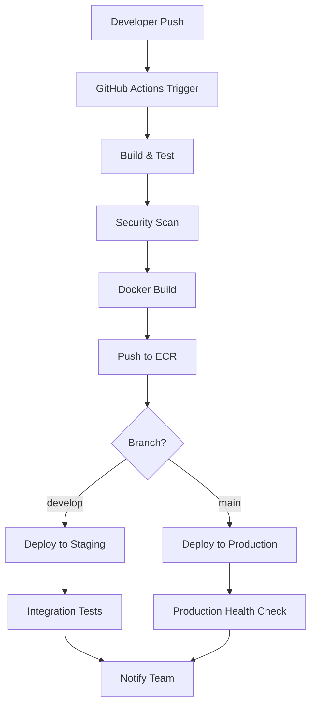

# Kiến Trúc Deployment AWS và CI/CD Pipeline

## 📋 Tổng Quan Kiến Trúc

### Kiến Trúc Tổng Thể
```
┌─────────────────────────────────────────────────────────────────┐
│                        AWS CLOUD                               │
├─────────────────────────────────────────────────────────────────┤
│  ┌─────────────────┐    ┌─────────────────────────────────────┐ │
│  │  PUBLIC SUBNET  │    │         PRIVATE SUBNET              │ │
│  │                 │    │                                     │ │
│  │ ┌─────────────┐ │    │ ┌─────────────────────────────────┐ │ │
│  │ │   EC2 #1    │ │    │ │            EC2 #2               │ │ │
│  │ │ API Gateway │◄┼────┼►│      Backend Services           │ │ │
│  │ │   (Ocelot)  │ │    │ │                                 │ │ │
│  │ │   Port: 80  │ │    │ │ • AuthAPI         (Port: 5000)  │ │ │
│  │ └─────────────┘ │    │ │ • ProductAPI      (Port: 5001)  │ │ │
│  │                 │    │ │ • CartAPI         (Port: 5002)  │ │ │
│  │ ┌─────────────┐ │    │ │ • OrderAPI        (Port: 5003)  │ │ │
│  │ │     ALB     │ │    │ │ • EmailAPI        (Port: 5004)  │ │ │
│  │ │ Load Balancer│ │    │ │ • NotificationAPI (Port: 5005)  │ │ │
│  │ └─────────────┘ │    │ │                                 │ │ │
│  └─────────────────┘    │ │ Infrastructure:                 │ │ │
│                         │ │ • PostgreSQL (5433,5434,5435)  │ │ │
│  ┌─────────────────┐    │ │ • Redis          (6379)        │ │ │
│  │   INTERNET      │    │ │ • RabbitMQ       (5672,15672)  │ │ │
│  │   GATEWAY       │    │ │ • Elasticsearch  (9200)        │ │ │
│  │                 │    │ │ • Kibana         (5601)        │ │ │
│  └─────────────────┘    │ │ • Grafana        (3000)        │ │ │
│                         │ │ • Prometheus     (9090)        │ │ │
│                         │ │ • Jaeger         (16686)       │ │ │
│                         │ │ • Seq            (5341,5342)   │ │ │
│                         │ └─────────────────────────────────┘ │ │
│                         └─────────────────────────────────────┘ │
└─────────────────────────────────────────────────────────────────┘
```

## 🏗️ Chi Tiết Kiến Trúc Deployment

### 1. EC2 Instance #1 - API Gateway (Public Subnet)

#### Thông Số Kỹ Thuật
- **Instance Type**: t3.medium (2 vCPU, 4GB RAM)
- **Operating System**: Amazon Linux 2
- **Storage**: 20GB GP3 SSD
- **Network**: Public Subnet với Internet Gateway
- **Security Group**: `gateway-sg`

#### Services Deployed
```yaml
Services:
  - API Gateway (Ocelot):
      Container: apigateway
      Port: 80 (Public)
      Internal Port: 8080
      Environment: Production
      Health Check: /health
      
Load Balancer:
  - Application Load Balancer (ALB)
  - Target Group: gateway-targets
  - Health Check Path: /health
  - Health Check Interval: 30s
```

#### Security Group Rules
```yaml
Inbound Rules:
  - Port 80 (HTTP): 0.0.0.0/0
  - Port 443 (HTTPS): 0.0.0.0/0  
  - Port 22 (SSH): Admin IP Only
  
Outbound Rules:
  - All Traffic to Backend EC2 Private IP
  - Port 443 to 0.0.0.0/0 (External Dependencies)
```

### 2. EC2 Instance #2 - Backend Services (Private Subnet)

#### Thông Số Kỹ Thuật
- **Instance Type**: t3.large (2 vCPU, 8GB RAM)
- **Operating System**: Amazon Linux 2
- **Storage**: 50GB GP3 SSD + 100GB EBS cho databases
- **Network**: Private Subnet với NAT Gateway
- **Security Group**: `backend-sg`

#### Microservices Architecture
```yaml
Authentication Service:
  Container: authAPI
  Port: 5000 → 8080
  Database: PostgreSQL (authdb:5435)
  Features:
    - JWT Token Generation
    - User Authentication
    - Identity Server Integration
    
Product Service:
  Container: productAPI  
  Port: 5001 → 8080
  gRPC Port: 5246 → 7001
  Database: PostgreSQL (basketdb:5433)
  Features:
    - Product Catalog Management
    - Search with Elasticsearch
    - AI Integration (Ollama)
    
Cart Service:
  Container: cartAPI
  Port: 5002 → 5027
  Database: PostgreSQL (basketdb:5433)
  Cache: Redis
  Features:
    - Shopping Cart Management
    - gRPC Communication with Product Service
    
Order Service:
  Container: orderAPI
  Port: 5003 → 8080
  Database: PostgreSQL (orderdb:5434)
  Message Queue: RabbitMQ
  Features:
    - Order Processing
    - Event-Driven Architecture
    
Email Service:
  Container: emailAPI
  Port: 5004 → 8080
  Database: PostgreSQL (basketdb:5433)
  Message Queue: RabbitMQ
  Features:
    - Email Notifications
    - Template Management
    
Notification Service:
  Container: notificationAPI
  Port: 5005 → 8080
  Database: PostgreSQL (basketdb:5433)
  Message Queue: RabbitMQ
  Features:
    - Push Notifications
    - Real-time Messaging
```

#### Infrastructure Services
```yaml
Databases:
  PostgreSQL Instances:
    - authdb (Port: 5435) - Authentication data
    - basketdb (Port: 5433) - Product, Cart, Email, Notification data  
    - orderdb (Port: 5434) - Order data
    
Cache Layer:
  Redis:
    Port: 6379
    Password Protected: Yes
    Memory: 512MB
    Policy: allkeys-lru
    
Message Broker:
  RabbitMQ:
    Management Port: 15672
    AMQP Port: 5672
    Clustering: Single Node
    
Search Engine:
  Elasticsearch:
    Port: 9200
    Single Node: Yes
    Memory: 512MB
    
Monitoring Stack:
  Grafana:
    Port: 3000
    Admin: admin/admin
    Dashboards: Pre-configured
    
  Prometheus:
    Port: 9090
    Scrape Interval: 15s
    Retention: 15d
    
  Jaeger:
    UI Port: 16686
    gRPC Port: 4317
    HTTP Port: 4318
    
Logging:
  Seq:
    UI Port: 5341
    Ingestion Port: 5342
    
  Kibana:
    Port: 5601
    Connected to Elasticsearch
```

## 🔄 CI/CD Pipeline Architecture

### 1. Source Control & Branching Strategy

```yaml
Git Workflow:
  Main Branches:
    - main: Production-ready code
    - develop: Integration branch
    - feature/*: Feature development
    - hotfix/*: Production fixes
    
  Protected Branches:
    - main: Requires PR + 2 approvals
    - develop: Requires PR + 1 approval
```

### 2. CI/CD Pipeline Flow



### 3. GitHub Actions Workflows

#### Build & Test Workflow
```yaml
# .github/workflows/build-test.yml
name: Build and Test
on:
  push:
    branches: [main, develop]
  pull_request:
    branches: [main, develop]

jobs:
  build-test:
    runs-on: ubuntu-latest
    strategy:
      matrix:
        service: [auth, product, cart, order, email, notification, gateway]
    
    steps:
      - name: Checkout Code
        uses: actions/checkout@v4
        
      - name: Setup .NET
        uses: actions/setup-dotnet@v3
        with:
          dotnet-version: '8.0.x'
          
      - name: Restore Dependencies
        run: dotnet restore
        
      - name: Build Solution
        run: dotnet build --no-restore --configuration Release
        
      - name: Run Unit Tests
        run: dotnet test --no-build --configuration Release --logger trx
        
      - name: Code Coverage
        run: dotnet test --collect:"XPlat Code Coverage"
        
      - name: SonarCloud Analysis
        uses: SonarSource/sonarcloud-github-action@master
        env:
          GITHUB_TOKEN: ${{ secrets.GITHUB_TOKEN }}
          SONAR_TOKEN: ${{ secrets.SONAR_TOKEN }}
```

#### Docker Build & Deploy Workflow
```yaml
# .github/workflows/deploy.yml
name: Deploy to AWS
on:
  push:
    branches: [main, develop]

jobs:
  deploy:
    runs-on: ubuntu-latest
    
    steps:
      - name: Checkout Code
        uses: actions/checkout@v4
        
      - name: Configure AWS Credentials
        uses: aws-actions/configure-aws-credentials@v2
        with:
          aws-access-key-id: ${{ secrets.AWS_ACCESS_KEY_ID }}
          aws-secret-access-key: ${{ secrets.AWS_SECRET_ACCESS_KEY }}
          aws-region: ap-southeast-1
          
      - name: Login to Amazon ECR
        uses: aws-actions/amazon-ecr-login@v1
        
      - name: Build and Push Docker Images
        run: |
          # Build all service images
          docker build -t $ECR_REGISTRY/auth-api:$GITHUB_SHA -f Services/Ecommerce.Authentication/Authentication.API/Dockerfile .
          docker build -t $ECR_REGISTRY/product-api:$GITHUB_SHA -f Services/Ecommerce.Production/Production.API/Dockerfile .
          docker build -t $ECR_REGISTRY/cart-api:$GITHUB_SHA -f Services/Ecommerce.Cart/Cart.API/Dockerfile .
          docker build -t $ECR_REGISTRY/order-api:$GITHUB_SHA -f Services/Ecommerce.Order/Order.API/Dockerfile .
          docker build -t $ECR_REGISTRY/email-api:$GITHUB_SHA -f Services/Ecommerce.Email/Email.API/Dockerfile .
          docker build -t $ECR_REGISTRY/notification-api:$GITHUB_SHA -f Services/Ecommerce.Notification/Notification.API/Dockerfile .
          docker build -t $ECR_REGISTRY/api-gateway:$GITHUB_SHA -f Gateways/APIGateway/Dockerfile .
          
          # Push all images
          docker push $ECR_REGISTRY/auth-api:$GITHUB_SHA
          docker push $ECR_REGISTRY/product-api:$GITHUB_SHA
          docker push $ECR_REGISTRY/cart-api:$GITHUB_SHA
          docker push $ECR_REGISTRY/order-api:$GITHUB_SHA
          docker push $ECR_REGISTRY/email-api:$GITHUB_SHA
          docker push $ECR_REGISTRY/notification-api:$GITHUB_SHA
          docker push $ECR_REGISTRY/api-gateway:$GITHUB_SHA
          
      - name: Deploy to EC2
        run: |
          # Deploy to staging or production based on branch
          if [ "${{ github.ref }}" == "refs/heads/main" ]; then
            ./scripts/deploy-production.sh
          else
            ./scripts/deploy-staging.sh
          fi
```

### 4. Deployment Scripts

#### Production Deployment Script
```bash
#!/bin/bash
# scripts/deploy-production.sh

set -e

echo "🚀 Starting Production Deployment..."

# Update environment variables
export IMAGE_TAG=$GITHUB_SHA
export ENVIRONMENT=production

# Deploy to Backend EC2
echo "📦 Deploying Backend Services..."
ssh -i ~/.ssh/backend-key.pem ec2-user@$BACKEND_EC2_IP << 'EOF'
  cd ~/deployment
  
  # Pull latest images
  docker-compose -f backend-compose.yml pull
  
  # Rolling update with zero downtime
  docker-compose -f backend-compose.yml up -d --no-deps authAPI
  sleep 30
  docker-compose -f backend-compose.yml up -d --no-deps productAPI
  sleep 30
  docker-compose -f backend-compose.yml up -d --no-deps cartAPI
  sleep 30
  docker-compose -f backend-compose.yml up -d --no-deps orderAPI
  sleep 30
  docker-compose -f backend-compose.yml up -d --no-deps emailAPI
  sleep 30
  docker-compose -f backend-compose.yml up -d --no-deps notificationAPI
  
  # Health check
  ./scripts/health-check.sh
EOF

# Deploy to Gateway EC2
echo "🌐 Deploying API Gateway..."
ssh -i ~/.ssh/gateway-key.pem ec2-user@$GATEWAY_EC2_IP << 'EOF'
  cd ~/deployment
  
  # Pull latest gateway image
  docker-compose -f gateway-compose.yml pull
  
  # Rolling update
  docker-compose -f gateway-compose.yml up -d
  
  # Health check
  curl -f http://localhost/health || exit 1
EOF

echo "✅ Production Deployment Completed!"
```

## 🔒 Security Architecture

### 1. Network Security

```yaml
VPC Configuration:
  CIDR: 10.0.0.0/16
  
  Public Subnet:
    CIDR: 10.0.1.0/24
    Resources: API Gateway, ALB, NAT Gateway
    
  Private Subnet:
    CIDR: 10.0.2.0/24  
    Resources: Backend Services, Databases
    
  Database Subnet:
    CIDR: 10.0.3.0/24
    Resources: RDS (if migrated)
```

### 2. Security Groups

```yaml
Gateway Security Group (gateway-sg):
  Inbound:
    - Port 80: 0.0.0.0/0 (HTTP)
    - Port 443: 0.0.0.0/0 (HTTPS)
    - Port 22: Admin-IP/32 (SSH)
  Outbound:
    - All: backend-sg (Backend communication)
    - Port 443: 0.0.0.0/0 (External APIs)
    
Backend Security Group (backend-sg):
  Inbound:
    - Ports 5000-5005: gateway-sg (API access)
    - Port 22: Admin-IP/32 (SSH)
    - All: backend-sg (Internal communication)
  Outbound:
    - All: 0.0.0.0/0
    
Database Security Group (db-sg):
  Inbound:
    - Port 5432: backend-sg (PostgreSQL)
    - Port 6379: backend-sg (Redis)
    - Port 5672: backend-sg (RabbitMQ)
  Outbound:
    - None
```

### 3. IAM Roles & Policies

```yaml
EC2 Instance Roles:
  GatewayInstanceRole:
    Policies:
      - CloudWatchAgentServerPolicy
      - ECRReadOnlyAccess
      - S3ReadOnlyAccess (for configs)
      
  BackendInstanceRole:
    Policies:
      - CloudWatchAgentServerPolicy
      - ECRReadOnlyAccess
      - S3ReadOnlyAccess (for configs)
      - SecretsManagerReadWrite (for DB credentials)
      
CI/CD Service Roles:
  GitHubActionsRole:
    Policies:
      - ECRFullAccess
      - EC2InstanceManagement
      - CloudFormationFullAccess
```

## 📊 Monitoring & Observability

### 1. Application Monitoring

```yaml
Metrics Collection:
  Prometheus:
    - Application metrics (.NET metrics)
    - Infrastructure metrics (node_exporter)
    - Custom business metrics
    
  Grafana Dashboards:
    - API Gateway Performance
    - Microservices Health
    - Database Performance
    - Infrastructure Overview
    - Business Metrics
    
Alerting Rules:
  Critical:
    - Service Down (> 1 minute)
    - High Error Rate (> 5%)
    - Database Connection Issues
    
  Warning:
    - High Response Time (> 2s)
    - Memory Usage (> 80%)
    - Disk Usage (> 85%)
```

### 2. Distributed Tracing

```yaml
Jaeger Configuration:
  Sampling Strategy: Probabilistic (10%)
  Retention: 7 days
  
  Trace Collection:
    - HTTP requests through API Gateway
    - Inter-service communication
    - Database queries
    - Message queue operations
```

### 3. Centralized Logging

```yaml
Log Aggregation:
  Seq:
    - Structured logging (JSON)
    - Log levels: Debug, Info, Warning, Error
    - Retention: 30 days
    
  ELK Stack:
    - Elasticsearch: Log storage
    - Kibana: Log visualization
    - Logstash: Log processing (if needed)
```

## 🔄 Backup & Disaster Recovery

### 1. Database Backup Strategy

```yaml
PostgreSQL Backup:
  Automated Backups:
    - Daily full backup to S3
    - Point-in-time recovery (PITR)
    - Cross-region replication
    
  Backup Schedule:
    - Full backup: Daily at 2 AM UTC
    - Incremental: Every 6 hours
    - Retention: 30 days
```

### 2. Application Backup

```yaml
Configuration Backup:
  - Docker images in ECR
  - Configuration files in S3
  - Infrastructure as Code (Terraform/CloudFormation)
  
Recovery Procedures:
  RTO (Recovery Time Objective): 30 minutes
  RPO (Recovery Point Objective): 1 hour
```

## 📈 Scaling Strategy

### 1. Horizontal Scaling

```yaml
Auto Scaling Groups:
  Gateway ASG:
    Min: 2 instances
    Max: 10 instances
    Target: CPU 70%
    
  Backend ASG:
    Min: 2 instances  
    Max: 20 instances
    Target: CPU 80%
    
Load Balancing:
  Application Load Balancer:
    - Health checks
    - SSL termination
    - Path-based routing
```

### 2. Database Scaling

```yaml
Read Replicas:
  - PostgreSQL read replicas
  - Read/write splitting
  - Connection pooling
  
Caching Strategy:
  - Redis for session data
  - Application-level caching
  - CDN for static content
```

## 💰 Cost Optimization

### 1. Resource Optimization

```yaml
Instance Types:
  Development: t3.micro/small
  Staging: t3.small/medium
  Production: t3.medium/large
  
Reserved Instances:
  - 1-year term for predictable workloads
  - Spot instances for non-critical tasks
  
Storage Optimization:
  - GP3 SSD for better price/performance
  - Lifecycle policies for S3 backups
```

### 2. Monitoring Costs

```yaml
Cost Tracking:
  - AWS Cost Explorer
  - Budget alerts
  - Resource tagging strategy
  
Optimization Tools:
  - AWS Trusted Advisor
  - AWS Compute Optimizer
  - Third-party tools (CloudHealth, etc.)
```

## 🚀 Deployment Checklist

### Pre-Deployment
- [ ] Code review completed
- [ ] Unit tests passing (>80% coverage)
- [ ] Integration tests passing
- [ ] Security scan completed
- [ ] Performance tests completed
- [ ] Database migrations tested
- [ ] Configuration validated
- [ ] Rollback plan prepared

### Deployment
- [ ] Backup current production
- [ ] Deploy to staging first
- [ ] Run smoke tests
- [ ] Deploy to production
- [ ] Monitor application health
- [ ] Verify all services running
- [ ] Check logs for errors
- [ ] Validate business functionality

### Post-Deployment
- [ ] Monitor for 24 hours
- [ ] Check performance metrics
- [ ] Verify monitoring alerts
- [ ] Update documentation
- [ ] Notify stakeholders
- [ ] Schedule post-mortem (if issues)

---

## 📞 Support & Maintenance

### On-Call Rotation
- **Primary**: DevOps Engineer
- **Secondary**: Senior Developer
- **Escalation**: Technical Lead

### Maintenance Windows
- **Scheduled**: Sunday 2-4 AM UTC
- **Emergency**: As needed with approval
- **Communication**: Slack + Email notifications

### Documentation Updates
- Architecture changes → Update this document
- New services → Update deployment scripts
- Configuration changes → Update runbooks